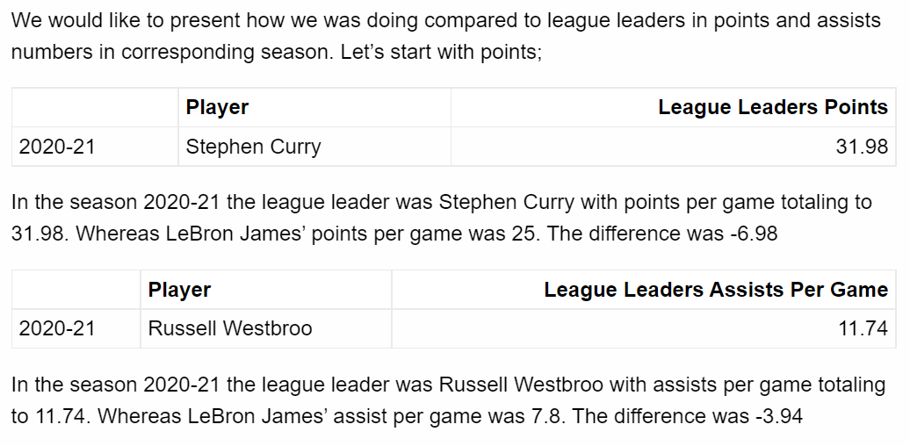
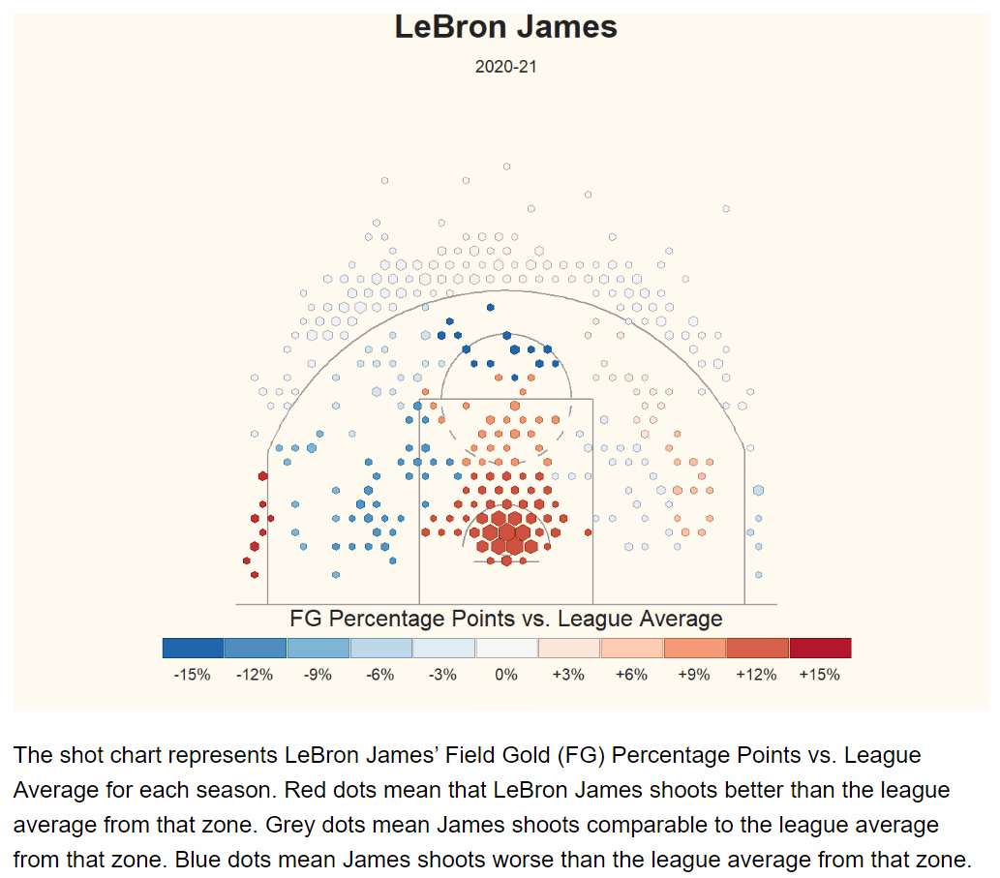

```{r setup, include=FALSE}
knitr::opts_chunk$set(echo = FALSE)
```

## LeBron James

For the project we have decided on American basketball player LeBron James. We analyzed his statistics with tables, graphs and shot charts and created reproducible file that updates with given data. Data source for this part is Kaggle.

<center>
 
</center>


## Basic Statistics

After presenting basic data about James we move on to our first table;


## Basic Statistics - cont.




## Basic Statistics - cont.


## Line Graph Over the Years


## Career Shot Chart by Season

Most players have their favorite spots on the court to shoot from – areas where they are most comfortable and confident in making shots. These statistics are available to us to see in the form of shot charts. While box scores count the number of makes and misses throughout the game, shot charts take it a step further by tracking the location of each shot.With that information, fans and analysts can pinpoint where players and teams are most effective with their shots.

Data Source for this part is NBA API.


## Career Shot Chart by Season - cont.



## Documentation and Systems Used 

<font size="2" align="center">

**Systems used:** 

* Windows 11 Home Version 21H2 
* RStudio Version 1.4.1106
* RMarkdown

**Libraries needed to reproduce this file;**


* kableExtra
* ggplot2
* dplyr
* hrbrthemes
* tidyverse
* hexbin
* jsonlite
* httr
* scales
* prismatic
* extrafont
* cowplot
* rmarkdown
* rjson
* Strings


</font>


